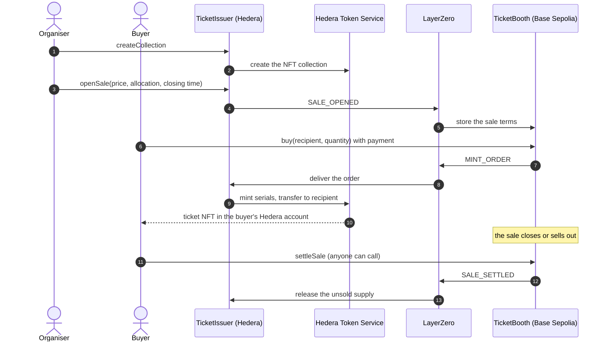

# Hopstile

**Sell tickets on any EVM chain. Mint them on Hedera.**

Hopstile is a [Scaffold-HBAR](https://docs.hedera.com/solutions/tools/scaffold-hbar/index) template for cross-chain ticket sales. A buyer pays on the chain where their funds already are. The order crosses to Hedera over [LayerZero](https://layerzero.network), and the ticket is minted there as a native Hedera Token Service (HTS) NFT and delivered to the buyer's Hedera account.

The template ships the two contracts, the message format between them, deploy scripts for Hedera testnet and Base Sepolia, mocks that let the whole flow run offline on one local chain, and the Scaffold-HBAR Next.js app.

```bash
npm create scaffold-hbar@latest -- --template sanmipaul/Hopstile
```

## Contents

- [What it does](#what-it-does)
- [How it works](#how-it-works)
- [Quick start](#quick-start)
- [Deploy to Hedera testnet and Base Sepolia](#deploy-to-hedera-testnet-and-base-sepolia)
- [Contracts](#contracts)
- [Hedera details](#hedera-details)
- [LayerZero details](#layerzero-details)
- [Configuration](#configuration)
- [Commands](#commands)
- [Tests](#tests)
- [Project layout](#project-layout)
- [Extending the template](#extending-the-template)
- [Limits and security notes](#limits-and-security-notes)
- [Troubleshooting](#troubleshooting)
- [Licence](#licence)

## What it does

An event organiser wants tickets that are real Hedera assets: visible in any Hedera wallet and on HashScan, with a resale royalty that the network itself enforces. Their buyers, though, hold ETH on Base or another EVM chain and have never used Hedera.

Hopstile separates the two concerns:

| | Where | Contract | Job |
| --- | --- | --- | --- |
| Issuing | Hedera | `TicketIssuer` | Owns the HTS ticket collection, decides the terms of each sale, mints and delivers tickets |
| Selling | Any other EVM chain | `TicketBooth` | Takes payment in that chain's native currency and orders the mint |

LayerZero is the only link between them. Nothing is bridged: the payment stays on the booth's chain for the organiser to withdraw, and the ticket only ever exists on Hedera.

The template is a starting point for anything that follows the same shape, "pay on one chain, receive a Hedera-native asset": event tickets, memberships, access passes, in-game items, or receipts for real-world goods.

## How it works



### The life of a sale

1. **Create the collection.** The organiser calls `TicketIssuer.createCollection` once. The issuer asks HTS to create a non-fungible token with a fixed maximum supply. The issuer contract is the token's treasury and the only holder of its supply key, so nothing else can ever mint a ticket.
2. **Open a sale.** The organiser calls `openSale` with a price, an allocation, a closing time and a per-order limit. The issuer reserves the allocation out of the collection's supply and sends the terms to the booth as a LayerZero message.
3. **The booth lists the sale.** When the message arrives, the booth stores the terms. It holds no inventory of its own: it can sell only what the issuer told it to, and never more than the allocation.
4. **A buyer pays.** The buyer calls `TicketBooth.buy(recipient, quantity)` and sends the ticket price plus the LayerZero fee in one transaction. The booth keeps the price as proceeds, counts the tickets as sold, and sends a mint order to Hedera.
5. **The issuer mints.** When the order arrives, the issuer mints one serial per ticket through HTS and transfers each to the recipient. Because the supply was reserved in step 2, a paid order can always be minted.
6. **Settle.** Once the sale has closed or sold out, anyone can call `TicketBooth.settleSale`. The booth reports how many tickets it sold, and the issuer releases the supply that went unsold so a later sale can use it.
7. **Afterwards.** The organiser withdraws the proceeds on the booth's chain with `withdrawProceeds`. A ticket holder marks a ticket as used at the door with `TicketIssuer.checkIn`.

### The three messages

Every message is `abi.encode(uint8 kind, struct)`. Both contracts encode and decode with the same library, [`TicketMessages.sol`](packages/hardhat/contracts/libraries/TicketMessages.sol).

| Kind | Direction | Fields | Effect on arrival |
| --- | --- | --- | --- |
| `SALE_OPENED` (1) | Issuer to booth | `saleId`, `price`, `allocation`, `closesAt`, `maxPerOrder` | The booth starts selling |
| `MINT_ORDER` (2) | Booth to issuer | `saleId`, `orderId`, `recipient`, `quantity` | The issuer mints and delivers the tickets |
| `SALE_SETTLED` (3) | Booth to issuer | `saleId`, `sold` | The issuer releases `allocation - sold` |

### Supply accounting

The issuer tracks three numbers, and at all times `minted + reserved + available = maxSupply`.

| Step | Minted | Reserved | Available |
| --- | --- | --- | --- |
| Collection created with a maximum supply of 500 | 0 | 0 | 500 |
| Sale opened with an allocation of 100 | 0 | 100 | 400 |
| Two tickets bought and minted | 2 | 98 | 400 |
| Sale settled with 2 sold | 2 | 0 | 498 |

LayerZero does not guarantee the order in which messages are executed, so a settlement can arrive before a mint order that was sent earlier. The issuer handles this: settling caps the sale at the number sold instead of closing it, so an order that is still in flight keeps its reservation and mints when it lands.

### What breaks without each piece

- **Without LayerZero** the booth never learns that a sale exists and the issuer never hears about a payment. There is no other path between the two contracts: no relayer, no admin function that mints on a buyer's behalf.
- **Without HTS** there is no ticket. The issuer does not implement ERC-721; the token, its supply cap, its royalty and its transfer rules all live in the Hedera Token Service.

## Quick start

### Requirements

- [Node.js](https://nodejs.org/) 20.18.3 or later
- [Yarn](https://yarnpkg.com/), through Corepack: `corepack enable`
- [Git](https://git-scm.com/)

### Create a project

```bash
npm create scaffold-hbar@latest -- --template sanmipaul/Hopstile
cd <your-project-name>
```

Or clone this repository and run `yarn install`.

### Run everything on one local chain

No testnet account, faucet or internet connection is needed for this. Use three terminals.

```bash
# Terminal 1: a local chain
yarn hardhat:chain

# Terminal 2: deploy both sides, wire them, create the collection and open a sale
yarn hardhat:deploy --network localhost

# Terminal 2: buy two tickets, then look at the result
TICKETS=2 yarn hardhat:buy --network localhost
yarn hardhat:status --network localhost

# Terminal 3: the frontend, at http://localhost:3000
yarn next:dev
```

`yarn hardhat:status` prints both contracts' view of the sale:

```text
TicketIssuer 0xDc64a140Aa3E981100a9becA4E685f962f0cF6C9
  ticket token     0xb501103B8cdDe17D2db376D7bf8422D94591dfF6
  supply           2 minted, 98 reserved, 400 available of 500
  sale 1           2 minted of 100 allocated, not settled

TicketBooth 0x5FC8d32690cc91D4c39d9d3abcBD16989F875707
  sale 1           2 sold of 100, open
  price            0.0001 per ticket, up to 4 per order
  proceeds         0.0002
```

### What the local chain stands in for

A live deployment spans two chains and two pieces of infrastructure. Locally, one Hardhat chain plays both sides and the deploy script installs a stand-in for each piece:

| Live | Local stand-in | What it keeps |
| --- | --- | --- |
| LayerZero EndpointV2 on each chain | Two linked [`MockEndpointV2`](packages/hardhat/contracts/mocks/MockEndpointV2.sol) contracts | The real `quote` and `send` signatures, fees that grow with the gas requested, refunds, and messages that stay stored and can be retried when delivery fails |
| Hedera Token Service at `0x167` | [`MockHederaTokenService`](packages/hardhat/contracts/mocks/MockHederaTokenService.sol), installed at the same address | Response codes instead of reverts, the supply key, the supply cap, and the rule that an account must be associated with a token to receive it |

Messages are delivered inside the transaction that sends them, so a purchase mints immediately.

The mock token service exists because the official HTS emulator in `@hashgraph/system-contracts-forking` does not yet assign serial numbers when it mints a non-fungible token, which the issuer depends on. `yarn hardhat:fork` still starts a chain that forks Hedera testnet if you need real testnet state for your own additions.

## Deploy to Hedera testnet and Base Sepolia

### 1. Fund one account on both networks

The same key deploys to both chains.

- Create an ECDSA account in the [Hedera Portal](https://portal.hedera.com/) and use its [faucet](https://portal.hedera.com/faucet) for testnet HBAR. Budget about 60 HBAR: 40 are sent with the collection creation to cover the HTS creation fee, and the rest covers deployment and the LayerZero fee.
- Send a little Base Sepolia ETH to the same address. About 0.01 ETH is plenty.

Import the key. It is stored encrypted in `packages/hardhat/.env`, which is ignored by git, and you are asked for the password on every deploy.

```bash
yarn hardhat:account:import
```

### 2. Deploy, in three commands

Each side needs the other's address before it can be wired, so the Hedera deploy runs twice. The scripts are safe to repeat: every step checks what is already done.

```bash
# Deploys TicketIssuer and creates the HTS ticket collection
yarn hardhat:deploy --network hederaTestnet

# Deploys TicketBooth and points it at the issuer
yarn hardhat:deploy --network baseSepolia

# Points the issuer at the booth, then opens the first sale over LayerZero
yarn hardhat:deploy --network hederaTestnet
```

The last command prints a HashScan link and a LayerZero Scan link for the transaction that sent the sale terms. The message usually arrives within a few minutes. Check that it has:

```bash
yarn hardhat:status --network baseSepolia
```

### 3. Buy a ticket

```bash
yarn hardhat:buy --network baseSepolia

# Or choose the quantity and the Hedera account that receives the tickets
TICKETS=2 RECIPIENT=0xYourHederaEvmAddress yarn hardhat:buy --network baseSepolia
```

Follow the order on LayerZero Scan with the printed link. When it is delivered, the tickets appear in the recipient's account on HashScan and in `yarn hardhat:status --network hederaTestnet`.

### What it costs

These are quotes from the live testnet endpoints on 4 October 2026. They change with gas prices, so always read the current figure from `quoteOpenSale`, `quoteBuy` or `quoteSettle`.

| Message | Gas bought on the destination | LayerZero fee |
| --- | --- | --- |
| Sale terms, Hedera to Base Sepolia | 200,000 | about 2.15 HBAR |
| Order for one ticket, Base Sepolia to Hedera | 750,000 | about 0.00014 ETH |
| Order for four tickets, Base Sepolia to Hedera | 2,100,000 | about 0.0002 ETH |
| Settlement, Base Sepolia to Hedera | 150,000 | about 0.00011 ETH |

## Contracts

All sources are in [`packages/hardhat/contracts`](packages/hardhat/contracts).

### `TicketIssuer` (Hedera)

A LayerZero OApp that owns the ticket collection.

| Function | Caller | What it does |
| --- | --- | --- |
| `createCollection(collection)` | Owner, payable | Creates the HTS NFT with this contract as treasury and supply key. `msg.value` pays the HTS creation fee |
| `openSale(boothEid, price, allocation, closesAt, maxPerOrder)` | Owner, payable | Reserves supply and sends the terms to the booth. `msg.value` pays the LayerZero fee; the surplus is refunded |
| `quoteOpenSale(boothEid)` | Anyone | LayerZero fee for `openSale`, in tinybars on Hedera |
| `claim(maxTickets)` | Ticket recipient | Collects tickets that could not be delivered when they were minted |
| `checkIn(serial)` | Ticket holder | Marks a ticket as used, once |
| `getSale(saleId)`, `activeSaleOf(boothEid)` | Anyone | The state of a sale |
| `availableSupply()`, `totalMinted()`, `reservedSupply()`, `maxSupply()` | Anyone | Supply accounting |
| `heldTicketsOf(account)` | Anyone | Serials waiting for `account` to claim |
| `setBoothReceiveGas(gas)` | Owner | Gas the booth gets when it receives sale terms |
| `sweepNative(to, amount)` | Owner | Withdraws HBAR held by the contract |
| `setPeer(eid, peer)` | Owner | Standard OApp function: names the booth on a chain |

Events: `CollectionCreated`, `SaleOpened`, `OrderFulfilled`, `TicketHeld`, `TicketClaimed`, `SaleSettled`, `TicketCheckedIn`, `BoothReceiveGasSet`.

### `TicketBooth` (any other EVM chain)

A LayerZero OApp that sells for one issuer.

| Function | Caller | What it does |
| --- | --- | --- |
| `buy(recipient, quantity)` | Anyone, payable | Takes the price, sends a mint order. Send the `total` from `quoteBuy`; the surplus is refunded |
| `quoteBuy(quantity)` | Anyone | Returns `cost`, `lzFee` and `total` in wei |
| `settleSale()` | Anyone, payable | After the sale closes or sells out, reports the final count to the issuer |
| `quoteSettle()` | Anyone | LayerZero fee for `settleSale` |
| `currentSale()`, `isOpen()` | Anyone | The sale and whether tickets can be bought now |
| `withdrawProceeds(to)` | Owner | Sends all ticket revenue to `to` |
| `setGasConfig(gasConfig)` | Owner | Gas the issuer gets on Hedera for an order and for a settlement |
| `setPeer(eid, peer)` | Owner | Standard OApp function: names the issuer |

Events: `SaleListed`, `TicketsOrdered`, `SaleSettlementSent`, `ProceedsWithdrawn`, `GasConfigSet`.

### Libraries, interfaces and mocks

| File | Purpose |
| --- | --- |
| [`libraries/TicketMessages.sol`](packages/hardhat/contracts/libraries/TicketMessages.sol) | The wire format of the three messages |
| [`libraries/LzOptions.sol`](packages/hardhat/contracts/libraries/LzOptions.sol) | Builds the LayerZero option that sets the gas for `lzReceive` on the destination |
| [`interfaces/IHederaTokenService.sol`](packages/hardhat/contracts/interfaces/IHederaTokenService.sol) | The part of the HTS system contract the issuer calls |
| [`interfaces/IHRC719.sol`](packages/hardhat/contracts/interfaces/IHRC719.sol) | `associate()` and friends, which every HTS token exposes at its own address |
| [`mocks/`](packages/hardhat/contracts/mocks) | Stand-ins for tests and local development. Never deploy them to a live network |

## Hedera details

Hedera's EVM behaves like any other in most respects. These are the places where it does not, and how the template deals with each.

**Tickets are HTS tokens, not ERC-721 contracts.** `createCollection` calls the HTS system contract at `0x167`. The resulting token has an address and answers ERC-721 read calls such as `ownerOf`, but its rules are enforced by the network. The issuer mints with `mintToken` and moves tickets with `transferNFT`.

**The royalty is enforced by the network.** The collection is created with an HTS royalty fee, 5% by default. Hedera charges it on every transfer that exchanges the ticket for value, whichever marketplace or wallet is used, and pays it to the collector. A fallback fee in HBAR applies when a ticket moves for nothing. Transfers out of the treasury are exempt, so delivering a newly minted ticket costs the buyer no royalty.

**An account must be associated with a token before it can receive it.** Many Hedera accounts accept new tokens automatically, but one with no free association slot does not. If HTS refuses a delivery, the issuer does not revert. It keeps the ticket, records who it belongs to, and emits `TicketHeld`. The recipient then calls `associate()` on the token address and `claim` on the issuer. This matters because the order has already been paid for on another chain: a recipient's account settings must never be able to block a mint.

**HTS reports failure with a response code.** A system contract call returns `22` for success and another code otherwise. The issuer checks the code and reverts with `HtsCallFailed(code)` when a mint fails, which leaves the LayerZero message stored and retryable.

**Value is in tinybars inside the EVM and in weibars over JSON-RPC.** On Hedera, `msg.value` and every fee a contract quotes are in tinybars, with 8 decimals. The JSON-RPC relay expects the `value` of a transaction in weibars, with 18 decimals, and divides by 10^10 on the way in. So the fee from `quoteOpenSale` must be multiplied by 10^10 before it is sent. `toRpcValue` in [`hopstileConfig.ts`](packages/hardhat/utils/hopstileConfig.ts) does this for the scripts, and a frontend must do the same.

**HTS charges its fees as gas.** Minting through the system contract costs far more gas than a storage write, and because HTS fees are set in US dollars, the gas a mint needs rises when HBAR falls. At 0.10 USD per HBAR, minting one serial costs about 270,000 gas. The booth therefore buys a generous amount of gas on Hedera for each order: `mintBase + mintPerTicket * quantity`, 300,000 and 450,000 by default. If the HBAR price drops far enough for mints to run out of gas, raise the budget with `TicketBooth.setGasConfig`; no redeploy is needed.

**Hedera refunds at most 20% of unused gas.** A gas limit far above what a call uses is paid for, so the scripts set explicit, modest limits on Hedera instead of large safe ones.

**HTS limits.** One `mintToken` call mints at most 10 serials, which is why `maxPerOrder` cannot exceed 10. Metadata is at most 100 bytes per ticket, so it holds a URI and the file it points to holds the details.

## LayerZero details

**Endpoints.** The template uses LayerZero V2.

| Network | Endpoint id | EndpointV2 address |
| --- | --- | --- |
| Hedera testnet | 40285 | `0xbD672D1562Dd32C23B563C989d8140122483631d` |
| Base Sepolia | 40245 | `0x6EDCE65403992e310A62460808c4b910D972f10f` |

**Peers.** An OApp accepts messages only from its peer on a given endpoint id and sends only to it. The `Wire` deploy step calls `setPeer` on both contracts. Until both sides are wired, `openSale` reverts with `NoPeer` and incoming messages are rejected.

**Options.** Each message carries an option that tells the LayerZero executor how much gas to give `lzReceive` on the destination. The sender pays for that gas as part of the fee. `LzOptions.lzReceive(gas)` produces the same bytes as LayerZero's `OptionsBuilder` and is documented field by field in the source.

**Fees and refunds.** `quoteOpenSale`, `quoteBuy` and `quoteSettle` return the fee. Send a little more than the quote in case the fee moves between the quote and the transaction; the endpoint refunds whatever it does not need to the caller. The scripts add 10%.

**Security stack.** The contracts use each endpoint's default configuration, which at the time of writing is one required verifier (the LayerZero Labs DVN) and the default executor on both networks. For production, set your own DVN configuration through the endpoint.

**Tracking a message.** Paste the transaction hash into [LayerZero Scan for testnets](https://testnet.layerzeroscan.com). The deploy and buy scripts print the link.

**When delivery fails.** If `lzReceive` reverts on the destination, for example because too little gas was bought, the message is not lost. It stays verified in the endpoint, and anyone can execute it again with more gas from LayerZero Scan. Raise the budget for later orders with `TicketBooth.setGasConfig`.

**No LayerZero tooling is required.** The template does not depend on LayerZero's Hardhat toolbox, so it keeps the stock Scaffold-HBAR toolchain: ethers v6, `hardhat-deploy`, and Yarn. It uses the official `@layerzerolabs/oapp-evm` contracts and nothing else from the SDK.

## Configuration

Every tunable is in one file, [`packages/hardhat/utils/hopstileConfig.ts`](packages/hardhat/utils/hopstileConfig.ts).

| Export | What it controls |
| --- | --- |
| `NETWORKS` | For each Hardhat network: its role (`issuer`, `booth` or `local`), LayerZero endpoint id and address, the network on the other side, and explorer links |
| `COLLECTION` | Name, symbol, memo, maximum supply, ticket metadata URI, royalty in basis points, royalty fallback fee, and the HBAR sent to pay the creation fee |
| `SALE` | Price, allocation, duration and per-order limit of the sale the deploy script opens |
| `GAS` | Gas bought on Hedera for an order (`mintBase`, `mintPerTicket`) and for a settlement (`settle`) |

Networks themselves, with their RPC URLs and chain ids, are in [`packages/hardhat/hardhat.config.ts`](packages/hardhat/hardhat.config.ts). Two environment variables override the public RPC endpoints: `HEDERA_RPC_URL` and `BASE_SEPOLIA_RPC_URL`.

## Commands

Run these from the project root.

| Command | What it does |
| --- | --- |
| `yarn hardhat:chain` | Starts a local chain on port 8545 |
| `yarn hardhat:fork` | Starts a local chain that forks Hedera testnet |
| `yarn hardhat:deploy --network <name>` | Deploys and configures whatever belongs on that network. Safe to repeat |
| `yarn hardhat:buy --network <booth network>` | Buys tickets with the deployer account. `TICKETS` and `RECIPIENT` are optional |
| `yarn hardhat:settle --network <booth network>` | Settles a sale that has closed or sold out |
| `yarn hardhat:status --network <name>` | Prints the state of the contracts on that network. Read-only |
| `yarn hardhat:compile` | Compiles the contracts |
| `yarn hardhat:test` | Runs the contract tests |
| `yarn hardhat:account:generate` / `yarn hardhat:account:import` | Creates or imports the encrypted deployer key |
| `yarn hardhat:account` | Shows the deployer address and its balances |
| `yarn next:dev` | Starts the frontend at http://localhost:3000 |
| `yarn next:build` | Builds the frontend for production |
| `yarn lint` / `yarn format` | Lints and formats both packages |

`yarn hardhat:deploy` without `--network` targets a throwaway in-memory chain. Always pass a network.

## Tests

```bash
yarn hardhat:test
```

76 tests run offline in a few seconds, against the same mocks the local chain uses. They are written as statements about behaviour, so the test list reads as a specification.

| File | What it establishes |
| --- | --- |
| [`TicketIssuer.test.ts`](packages/hardhat/test/TicketIssuer.test.ts) | The collection is created with the issuer as treasury and only minter, with the royalty passed to HTS. Sales reserve supply and cannot exceed it. Only a ticket's current holder can check it in |
| [`TicketBooth.test.ts`](packages/hardhat/test/TicketBooth.test.ts) | A buyer pays exactly the ticket cost plus the LayerZero fee and is refunded the rest. The booth never sells beyond its allocation. Settlement releases unsold supply and makes room for the next sale |
| [`Delivery.test.ts`](packages/hardhat/test/Delivery.test.ts) | A recipient that cannot receive the token does not block an order. Orders and settlements may arrive in any order. A delivery that fails for lack of gas, or because HTS is unavailable, is kept and succeeds on retry. Each contract accepts messages only from the endpoint and only from its peer |
| [`Codec.test.ts`](packages/hardhat/test/Codec.test.ts) | The option bytes equal the ones the live endpoints returned a fee quote for, and every message survives encoding and decoding |
| [`DeployScripts.test.ts`](packages/hardhat/test/DeployScripts.test.ts) | The deploy scripts leave a wired pair with an open sale, the largest allowed order mints within the configured gas, and a second run changes nothing |

Every test that mints or settles ends with the same check: minted, reserved and available supply add up to the maximum, the HTS token's supply equals what the issuer says it minted, and the booth holds exactly its unpaid proceeds.

## Project layout

```text
packages/
├── hardhat/
│   ├── contracts/
│   │   ├── TicketIssuer.sol        Hedera side: HTS collection, sales, minting
│   │   ├── TicketBooth.sol         Remote side: payment, orders, settlement
│   │   ├── interfaces/             HTS system contract and HIP-719
│   │   ├── libraries/              Message format and LayerZero options
│   │   └── mocks/                  Local stand-ins for LayerZero and HTS
│   ├── deploy/
│   │   ├── 00_deploy_local_mocks.ts
│   │   ├── 01_deploy_ticket_issuer.ts
│   │   ├── 02_deploy_ticket_booth.ts
│   │   ├── 03_wire_peers.ts
│   │   ├── 04_create_collection.ts
│   │   ├── 05_open_sale.ts
│   │   ├── 90_buy_ticket.ts        Runs only through yarn hardhat:buy
│   │   └── 91_settle_sale.ts       Runs only through yarn hardhat:settle
│   ├── scripts/status.ts
│   ├── test/                       Five test files and shared fixtures
│   ├── utils/hopstileConfig.ts     Every tunable
│   └── hardhat.config.ts
└── nextjs/                         Scaffold-HBAR Next.js app
    ├── contracts/deployedContracts.ts   Generated by the deploy command
    └── public/ticket.json               Ticket metadata the collection points at

template.json                       Scaffold-HBAR template manifest
AGENTS.md                           Briefing for coding agents
```

## Extending the template

**Sell on another chain.** Add the chain to `networks` in `hardhat.config.ts`, add an entry with role `booth` to `NETWORKS` with its endpoint id and address from [LayerZero's deployments list](https://docs.layerzero.network/v2/deployments/deployed-contracts), deploy there, and rerun the Hedera deploy. The issuer keeps one sale per booth chain, so several booths can sell from the same collection at once, each within its own allocation.

**Take payment in a token.** In `TicketBooth.buy`, pull the price with `transferFrom` instead of reading it from `msg.value`, and pass all of `msg.value` as the LayerZero fee. The message to Hedera does not change.

**Give tickets different metadata.** `TicketIssuer._mint` stores the same metadata on every ticket. Add a tier or seat to `MintOrder` and build the metadata from it.

**Add a message.** Add a kind, a struct and an encode and decode pair to `TicketMessages`, then handle the kind in the receiving contract's `_lzReceive`. A refund path, for example, would be a message from the issuer back to the booth.

**Go to mainnet.** Add `hederaMainnet` and the booth's mainnet to `NETWORKS` with their mainnet endpoint ids and addresses, configure your own DVNs, and have the contracts reviewed first.

## Limits and security notes

- The contracts have not been audited. Treat them as a template to build on, not as production code.
- The owner of each contract is a single account. It can open sales, change gas budgets, withdraw proceeds and change the peer. Changing the peer redirects who the contract trusts, so in production the owner should be a multisig.
- There is no refund path. The design makes one unnecessary for supply, because a booth cannot sell more than the issuer reserved for it, but a buyer who names a wrong recipient cannot be made whole on-chain.
- An order that names a recipient who cannot receive the token is not lost: the ticket waits in the issuer until that recipient claims it.
- The booth trusts the issuer for the terms of a sale, and the issuer trusts the booth for the orders and the final count. That trust is exactly the peer relationship, so the security of the system is the security of the LayerZero configuration between the two.
- Prices are in the booth chain's native currency and fixed for the length of a sale.

## Troubleshooting

| Symptom | Cause and fix |
| --- | --- |
| `NoPeer` when opening a sale | The issuer is not wired to a booth yet. Deploy the booth, then run the Hedera deploy again |
| The booth shows no sale after `openSale` | The message is still in transit. Open the LayerZero Scan link printed by the deploy; delivery usually takes a few minutes |
| `buy` logs "The booth has no open sale" | Either the sale terms have not arrived, or the sale closed or sold out |
| `InsufficientPayment` | Less than `price * quantity` was sent. Send the `total` from `quoteBuy` |
| Order delivered but no ticket in the wallet | The recipient was not associated with the token. Check `heldTicketsOf`, call `associate()` on the token address, then `claim` |
| LayerZero Scan shows the message as failed on Hedera | Too little gas was bought for the mint. Retry it from LayerZero Scan with more gas, and raise `GAS` or call `setGasConfig` |
| `HtsCallFailed(code)` | HTS refused a call. The number is a Hedera response code; look it up in the [response code list](https://github.com/hashgraph/hedera-protobufs/blob/main/services/response_code.proto) |
| A transaction on Hedera fails with too little value | The fee was sent in tinybars. Multiply the quote by 10^10; see [Hedera details](#hedera-details) |

## Licence

MIT. See [LICENCE](LICENCE).
